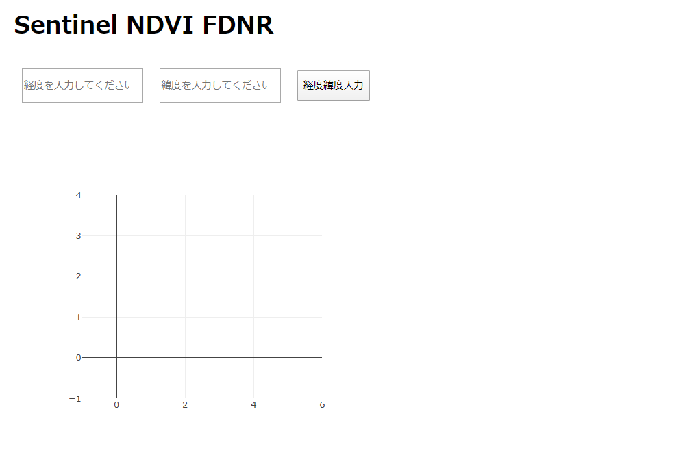
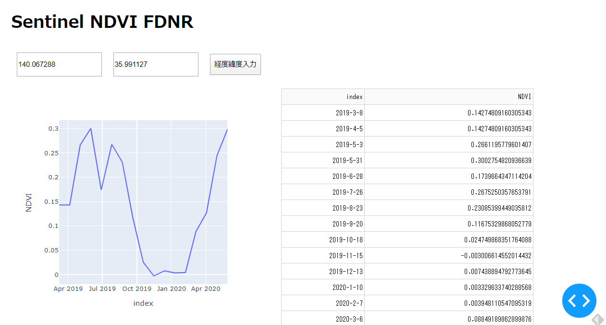

## Sentinel_ndvi_app使い方

- まずディレクトリを取得し、そのディレクトリに移動します。

    $ git clone https://github.com/mazarimono/sentinel_ndvi_app.git    
    $ cd sentinel_ndvi_app

次にapp.pyの上にあるarc_passに自身のArcGISのIDとSecretをコピペします。

    $ app.pyの上の方
    arc_pass = {
        "ClientID": yourID,   <-- 自身のIDを
        "ClientSecret": YourSecret, <-- 自身のパスワードを入力
        }

次にDockerのイメージを作成します。    
     
    $ docker build -t sagri-app .

Dockerコンテナを起動します。

    $ docker run --rm -it -v $(pwd):/work -P -p 8050:8050 sagri-app python app.py 

ブラウザで http://localhost:8050/ にアクセスすると、アプリにアクセスできます。    
     

経度と緯度を入力し横のボタンを押すと、データ収集が始まります。2分くらいするとグラフとデータが表示されます。

